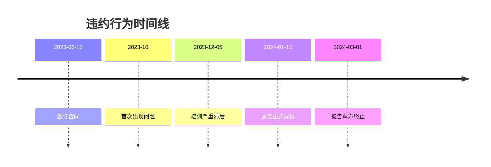

# 邮件往来事实梳理

## 整理人

@王芳

## 关键邮件记录

### 2023年10月 - 服务问题的最早信号

**邮件1**（2023-10-12）
> 发件人：原告技术负责人
> 主题：关于技术对接进度
> 内容：指出被告交付的第二批文档存在严重缺失，关键接口说明不完整。

**邮件2**（2023-10-25）
> 发件人：被告项目经理
> 主题：RE: 关于技术对接进度
> 内容：承认文档问题，承诺11月中旬补齐。

### 2023年12月 - 问题持续

**邮件3**（2023-12-05）
> 发件人：原告技术负责人
> 主题：培训计划严重滞后
> 内容：合同约定12次培训，仅完成1次。被告多次推迟后续培训。

**邮件4**（2023-12-20）
> 发件人：被告项目经理
> 主题：RE: 培训计划严重滞后
> 内容：因团队调整，1月份安排2次培训。

### 2024年1月 - 正式异议

**邮件5**（2024-01-15）
> 发件人：原告法务
> 主题：正式异议通知
> 内容：指出被告多项违约，要求5日内书面说明。

**邮件6**（2024-01-20）
> 发件人：被告法务
> 主题：RE: 正式异议通知
> 内容：称部分问题已解决，其余属于理解差异。

### 2024年3月 - 被告单方终止

**邮件7**（2024-03-01）
> 发件人：被告CEO
> 主题：合作终止通知
> 内容：单方宣布终止合作，理由是"战略调整"。

## 事实认定要点

1. **2023年10月**：被告最早出现履行问题，承诺改进但未兑现
2. **2023年12月**：培训严重滞后，被告再次承诺但仍未兑现
3. **2024年1月**：原告正式提出异议
4. **2024年3月**：被告在原告异议后不到2个月即单方终止

## 违约时间线

## 待补充

- [ ] 2023年10月之前的邮件记录（验证合同履行初期情况）
- [ ] 被告内部沟通记录（如有）

---
*整理：王芳*
*完成日期：2026-04-20*
*关联 Issue：#9*
