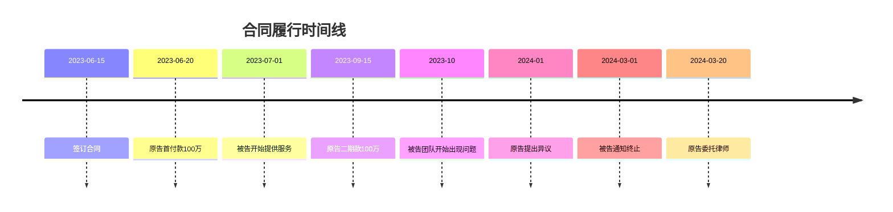

# 事实梳理

## 争议焦点

1. 被告是否存在违约行为？
2. 若存在违约，违约程度如何？
3. 原告的实际损失如何计算？
4. 预期利益损失是否应支持？

## 事实时间线

## 证据清单

### 原告证据

| 编号 | 证据名称 | 证明内容 | 状态 |
|------|---------|---------|------|
| P1 | 技术合作协议 | 合同权利义务 | 已收集 |
| P2 | 付款凭证 | 原告已按时付款 | 已收集 |
| P3 | 被告终止服务通知 | 被告违约事实 | 已收集 |
| P4 | 往来邮件记录 | 被告服务不达标 | 待整理 |
| P5 | 技术文档交付记录 | 被告未完整交付 | 待核实 |

### 被告可能提交证据

| 证据 | 我方质证要点 |
|------|-------------|
| 原告投诉记录 | 需核实是否构成拒付理由 |
| 内部沟通记录 | 需审查是否经过篡改 |
| 行业分析报告 | 需审查与本案的关联性 |

## 待补充事实

- [ ] 2023年10月被告团队异常的具体情况
- [ ] 被告是否与其他客户存在类似纠纷
- [ ] 原告自主替代方案的成本
