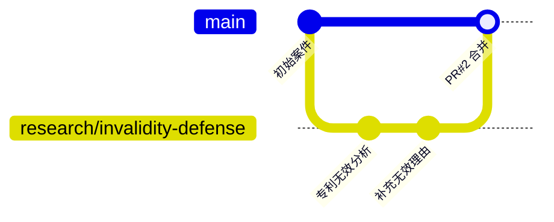

# 分支处理流程

## 基本流程



## 操作步骤

### 1. 从 main 创建研究分支

```bash
git checkout main
git pull origin main
git checkout -b research/your-topic
```

### 2. 在分支上工作

```bash
# 添加文件
git add .
git commit -m "描述本次工作"
git push origin research/your-topic
```

### 3. 创建 PR

在 GitHub 上创建 Pull Request，关联相关 Issue。

### 4. 等待审核与合并

主办律师审核后，PR 将被合并到 main 分支。
